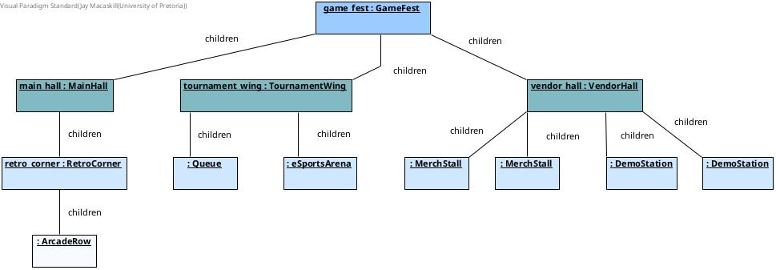
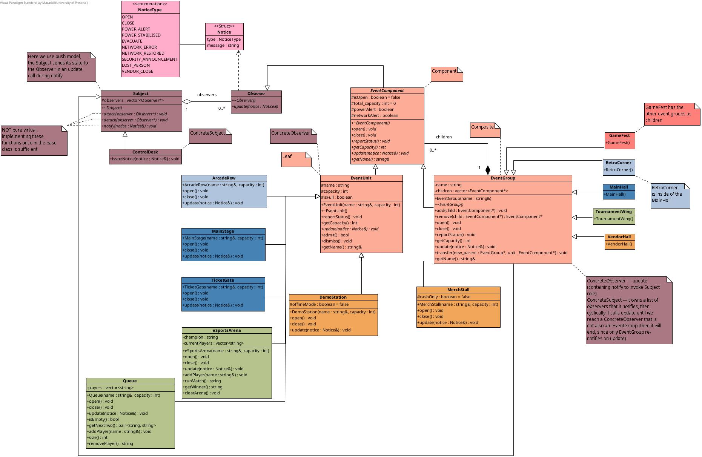
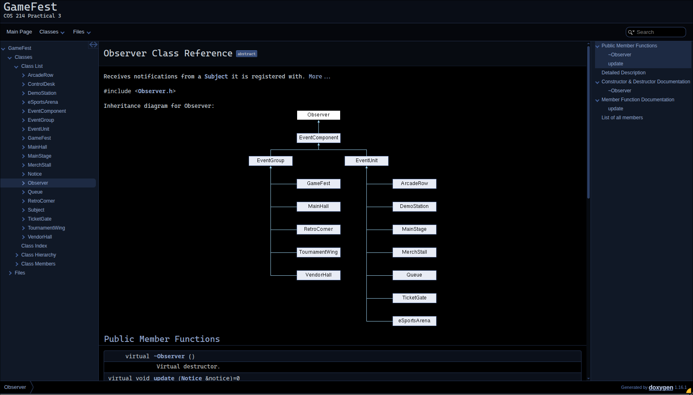

# 🎮 GameFest — EventFlow Live Event Coordination Engine

COS 214 Practical 3 — *EventFlow: Designing a Live Event Coordination Engine*

<p align="center">
  
</p>

---

## 👥 Team

| Name | Student Number |
|---|---|
| Dian le Roux | 25147065 |
| Marko de Swardt | 24658562 |
| Jay Macaskill | 25198387 |

---

## 🎪 Event Concept

**GameFest** is a gaming convention made up of nested operational areas — halls, wings, and vendor
spaces — each containing individual operational units such as stages, gates, arcades, tournament
queues, merch stalls and demo stations. A central `ControlDesk` issues event-wide notices (opening,
power alerts, network errors, security announcements, lost-person alerts, vendor closures and
evacuation), and different concrete units react in their own way — a stage dims its lights, an
arcade closes outright, a merch stall switches to cash-only — all through polymorphism rather than
type-checking.

<p align="center">
  
</p>

### Example structure

```
GameFest
├── Main Hall
│   ├── Classic Games
│   │   └── Retro Corner
│   │       ├── Arcade Row
│   │       └── Pinball Alley
│   ├── Ticket Gate
│   ├── Main Stage
│   └── Cosplay Corner
├── Tournament Wing
│   ├── Tournament Queue
│   └── eSports Arena
└── Vendor Hall
    ├── Merch Stall (Adventure Time)
    ├── Merch Stall (Minecraft)
    ├── Demo Station (Mortal Kombat)
    └── Demo Station (Paralives)
```

<p align="center">
  
  <br/>
  <sub><em>Object diagram — GameFest ownership tree</em></sub>
</p>

---

## 🧩 Design Patterns

GameFest is built around two collaborating GoF patterns:

- **Composite** — answers *"what is contained inside this part of the event?"*
  `EventComponent` is the common interface, `EventUnit` the Leaf (stages, gates, vendors, staff
  teams), and `EventGroup` the Composite (halls, wings, zones). A Composite can contain both Leaves
  and other Composites, and operations like `reportStatus()` and `getCapacity()` recurse down the
  tree.

- **Observer** — answers *"who needs to hear about this change?"*
  `Subject` and `Observer` allow the `ControlDesk` to `attach()`/`detach()` event areas and
  `issueNotice(...)` to cascade a `Notice` down through the Composite tree via `update(...)`. Some
  classes (like `EventGroup`) are both a Composite node *and* an Observer — receiving a notice from
  above and re-notifying interested children below.

<p align="center">
  
  <br/>
  <sub><em>Full class diagram — click <a href="practicals/practical_3/img/uml.jpg">here</a> to view full size</em></sub>
</p>

---

## 🛠️ Building

This project targets **C++11** and is built with the provided `Makefile`.

```bash
make
```

This produces an executable named:

```
eventflow
```

To clean build artefacts:

```bash
make clean
```

---

## ▶️ Running

```bash
./eventflow
```

This runs a full simulation of a day at GameFest: opening the festival, admitting and dismissing
guests, cascading notices (power alerts, network errors, security announcements, lost-person
alerts, vendor closures, evacuation), a runtime reorganisation (a merch stall transferred between
halls), and a clean shutdown with correct Composite/Observer teardown.

<p align="center">
  
</p>

---

## 📚 Documentation (Doxygen)

All public classes and operations are documented with Doxygen comments. To generate browsable
documentation:

```bash
doxygen Doxyfile
```

Generated docs will be output to `docs/html/`. Open `docs/html/index.html` in a browser to view.

<p align="center">
  
</p>

---

## 🔀 GitHub Workflow

This repository was used throughout development by all three team members, with commit history
reflecting ongoing, divided work rather than a single end-of-practical upload.

---

<p align="center">
  
</p>